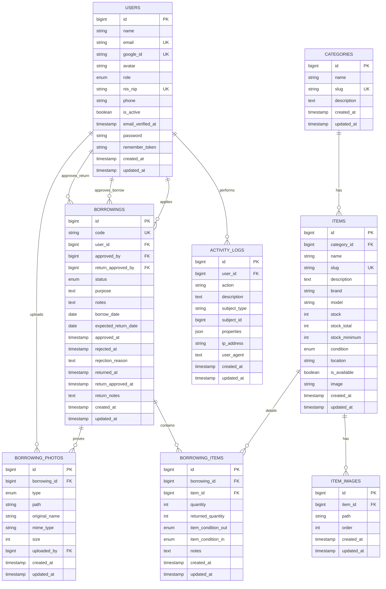

# 07 — DATABASE DESIGN
## Sistem Inventaris & Peminjaman Barang — Jurusan TKJ

---

## 1. Entity Relationship Diagram (ERD) — Mermaid

---

## 2. Struktur Kamus Data Entitas (Data Dictionary)

### 2.1 USERS
| Nama Field | Tipe Data | Nullable | Keys / Constraints | Keterangan |
|---|---|---|---|---|
| `id` | BIGINT UNSIGNED | No | PK, Auto Increment | ID unik user |
| `name` | VARCHAR(255) | No | — | Nama lengkap |
| `email` | VARCHAR(255) | No | Unique | Email Google/sekolah |
| `google_id` | VARCHAR(255) | Yes | Unique | ID unik dari Google OAuth |
| `avatar` | VARCHAR(255) | Yes | — | URL Foto profil Google |
| `role` | ENUM | No | Default: 'siswa' | 'siswa', 'guru', 'admin' |
| `nis_nip` | VARCHAR(30) | Yes | Unique | NIS (Siswa) atau NIP (Guru) |
| `phone` | VARCHAR(20) | Yes | — | Nomor WhatsApp aktif |
| `is_active` | BOOLEAN | No | Default: true | Status blokir user |
| `email_verified_at`| TIMESTAMP | Yes | — | Waktu verifikasi email |
| `password` | VARCHAR(255) | Yes | — | Nullable (login via OAuth) |
| `remember_token` | VARCHAR(100) | Yes | — | Token persistensi login |

### 2.2 ITEMS
| Nama Field | Tipe Data | Nullable | Keys / Constraints | Keterangan |
|---|---|---|---|---|
| `id` | BIGINT UNSIGNED | No | PK, Auto Increment | ID unik barang |
| `category_id` | BIGINT UNSIGNED | No | FK -> `categories.id` | Kategori barang |
| `name` | VARCHAR(255) | No | — | Nama barang |
| `slug` | VARCHAR(255) | No | Unique | Slug untuk rute ramah SEO |
| `description` | TEXT | Yes | — | Spesifikasi/deskripsi barang|
| `brand` | VARCHAR(100) | Yes | — | Merek barang |
| `model` | VARCHAR(100) | Yes | — | Seri/model manufaktur |
| `stock` | INT UNSIGNED | No | Default: 0 | Stok aktif saat ini |
| `stock_total` | INT UNSIGNED | No | Default: 0 | Total aset fisik |
| `stock_minimum` | INT UNSIGNED | No | Default: 1 | Batas peringatan restock |
| `condition` | ENUM | No | Default: 'baik' | 'baik', 'rusak_ringan', 'rusak_berat' |
| `location` | VARCHAR(100) | Yes | — | Lemari/ruang penyimpanan |
| `is_available` | BOOLEAN | No | Default: true | Status keaktifan barang |
| `image` | VARCHAR(255) | Yes | — | Path foto utama barang |

---

## 3. Strategi Indeks Database

Pemberian indeks untuk performa query pencarian dan saringan (filter):

1. **`users`**:
   - `INDEX(role)`: Mempercepat penyaringan daftar siswa atau guru.
   - `INDEX(is_active)`: Digunakan setiap kali verifikasi sesi login.

2. **`items`**:
   - `INDEX(category_id)`: Mempercepat join data kategori.
   - `INDEX(condition)`: Mempercepat saringan kondisi barang.
   - `INDEX(is_available)`: Mempercepat saringan barang yang bisa dipinjam.
   - `FULLTEXT(name, brand, model)`: Mempercepat fitur search bar.

3. **`borrowings`**:
   - `INDEX(user_id)`: Mempercepat query peminjaman milik siswa tertentu.
   - `INDEX(status)`: Digunakan di dashboard admin untuk melihat antrean `pending` dan `returning`.
   - `INDEX(borrow_date)`: Mempercepat saringan riwayat transaksi berdasarkan rentang tanggal.

4. **`activity_logs`**:
   - `INDEX(user_id)`: Filter log berdasarkan pelaku.
   - `INDEX(subject_type, subject_id)`: Query relasional polimorfik untuk menelusuri riwayat suatu model.

---

## 4. Normalisasi Database

Desain basis data ini dirancang untuk memenuhi kriteria **Bentuk Normal Ketiga (3NF)** guna menghindari anomali data:

### Bentuk Normal Pertama (1NF)
- Semua atribut bernilai atomik (tidak ada array/multi-value tersembunyi).
- *Contoh penerapan:* Setiap relasi gambar barang dipisah ke tabel detail `item_images` daripada disimpan sebagai string koma di kolom `items.images`.

### Bentuk Normal Kedua (2NF)
- Memenuhi 1NF dan semua atribut non-kunci bergantung penuh pada Primary Key.
- *Contoh penerapan:* Detail barang dipisah dari tabel transaksi peminjaman. Di tabel `borrowing_items`, sistem hanya mencatat `item_id` beserta detail transaksi peminjamannya (`quantity`, `item_condition_out`), bukan mengulang data merek atau kategori barang.

### Bentuk Normal Ketiga (3NF)
- Memenuhi 2NF dan tidak ada ketergantungan transitif antar atribut non-kunci.
- *Contoh penerapan:* Data guru/admin yang menyetujui peminjaman disimpan sebagai foreign key (`approved_by` -> `users.id`), bukan menyimpan nama atau NIP guru tersebut di dalam tabel `borrowings`. Jika ada perubahan profil guru, data transaksi historis tidak mengalami inkonsistensi.
- Data alamat gambar selfie dipisah menjadi entitas `borrowing_photos` yang dinormalisasi dengan relasi foreign key mengarah langsung ke primary key `borrowings.id`.
